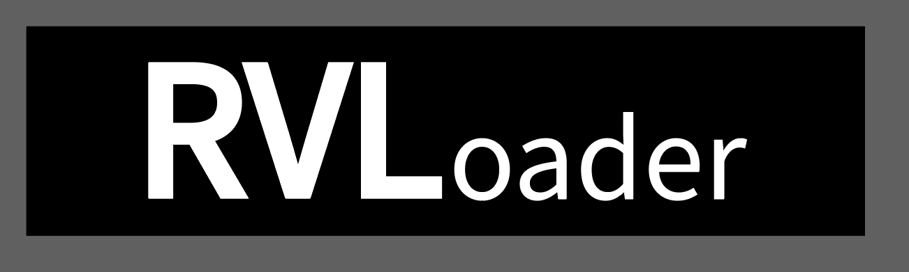

[](https://github.com/Aurelio92/RVLoader/actions/workflows/build.yml)



# RVLoader

This repository contains the source code of RVLoader, a Game loader specifically designed for Wii portables.
It's supposed to completely replace the Wii's menu with a custom interface, that has full Gamecube controller and Wiimote support.

All games [Wii & Gamecube], Homebrew, Channels, etc. are loaded from USB.

But RVLoader is not just a simple GUI! It comes packed with features, quite a few hacks and more to make the life of Wii portablizers easier.


## Features
 
 - Wii game loading from USB via Hiidra
 - Gamecube game loading from USB via Nintendont
 - Direct Homebrew loading [incl. ELF support]
 - Wii channels support
 - VirtualConsole/WiiWare titles are supported [experimental]
 - Built-in installer that automatically detects if RVL is not installed and prompts the user to install it
 - Front-end completely developed from scratch and with Wii portables in mind
 - Integrated system clock if the MX chip [RTC] is found
 - Wide LUA integration for greater customization
 - Complete Wiimote & Gamecube controller support
 - Custom theme integration

### Hacks
 - VGA patches [makes the Wii output VGA video signal]
 - NoWifi patches [makes the Wii boot even without a Wifi module]
 - GC2Wiimote [allows playing Wii games with a Gamecube controller]
 - Bluetooth module is not required anymore to boot Wii games

### Custom PCB Support
 - Integrated GC+2.0 and PMS2 settings
 - Per-game GC+2.0 [custom controller PCB] remappable buttons
 - RVL-DD [DirectDrive custom PCB] in-game brightness setting
 - UAMP2 [Custom audio amplifier with on-screen control]

## Install

In order to install RVLoader you need to have your Wii already hacked (e.g. the homebrew channel is installed) and updated. Then simply follow these steps:

 1. Unzip the archive in the root of your USB drive, making sure to merge the folders and not replacing them (to keep all the other homebrews that you might already have)
 2. Plug your USB drive in your Wii and turn it on
 3. Boot RVLoader from the homebrew channel, postloader or whatever you have
 4. RVLoader will detect if it is not installed currently and ask you to do it
 5. Press A to launch the installer
 6. After the initialization is complete the installer will perform a sanity check. If it complains about missing some IOS modules check the note at the end.
 7. Select if you want to patch out the WiFi module and if you want VGA. If you don't have the WiFi module on your board or you plan on removing it, PLEASE, make sure to have the "Patch out WiFi" option set to yes.
 8. Once you have selected the wanted options, press Start/Home once.
 9. The installer will show you the selected options and ask for confirmation. To proceed hold Start/Home for a couple of seconds until the process starts.
 10. Wait until the end of the process, it should take about a minute and then exit to RVLoader.

From now on RVLoader will boot automatically when turning your Wii on. 

**NOTE:** If step 6 fails: RVL installer grabs the required IOS modules from your Wii's NAND. If your Wii is not updated, it might be possible that the installer won't be able to find some of the required modules. In this case the installer will try to get those modules from the following IOS wads that must be placed on the root of your USB drive:

 - IOS36-64-v3608.wad
 - IOS58-64-v6176.wad
 - IOS80-64-v6944.wad

These files can be legally downloaded through NUS Downloader: http://wiibrew.org/wiki/NUS_Downloader

## Build From Source

Build binaries using `make` and clean up using: `make clean`.

### Dependencies

DevkitPro with packages:
 - wii-dev
 - libfat-ogc
 - ppc-mxml
 - ppc-libpng
 - ppc-freetype
 - ppc-zlib
 - ppc-bzip2


## Controls
The UI is pretty simple, though still in development. Basic controls are:

### Main Menu

 - `DPad` or `left analog stick` to move through the different games
 - `A` to boot a game
 - `B` (or `1` on a Wiimote) to open the per-game configuration menu
 - `C-Stick` (or `Z+DPad`, or `B+DPad` on Wiimote) to switch between the different game menus (GC, Wii, homebrew, ...). Simply move the C-Stick and a selector wheel will show up. Holding the C-Stick in a position for a couple of seconds will confirm the selection. In case you are using a Wiimote, hold the B button and move the DPad to simulate the C-Stick movements. You can also use the right stick on a Classic Controller or the Nunchuk stick while holding the C button.

### Key Combinations

#### Safe Menu 

The safe menu can be used to:
 - Boot into priiloader
 - Reset GC+ Sticks
 - Boot directly into System Menu
 - Run the installer again

Enter safe menu by holding `L + R + Z` on boot

To force VGA in safe menu hold `R + L + Z + B` on boot

#### RVL-HUD
 - `Z + Y + [Dpad Up/Down]` - increase / decrease UAMP2 audio volume
 - `Z + X + [Dpad Up/Down]` - increase / decrease RVL-DD backlight brightness


## Installing Games/Homebrew/etc.

### Gamecube Games File Structure

```
USB://
  games/
    Batman Begins/
      game.iso
    Game Description/
      game.iso
      disc2.iso
```

### Wii Games File Structure

```
USB://
  wbfs/
    IRONMAN.wbfs
    ANYDESCRIPTION.wbfs
    AnySubfolder/
      whatever.wbfs
```

### Homebrew

Copy Homebrew into `/apps` folder on the root of your USB drive.

### VirtualConsole, WiiWare & Wii Channels

**VC/WiiWare titles are supported, but still experimental!**

Copy VirtualConsole `.wad` files in the `/vc` folder on the root of your USB drive. 

WiiWare and Wii channels go in the `/channels` folder on the root of your USB drive.

### Installing Covers

Installing Covers

Game covers can be downloaded from [GameTDB](https://www.gametdb.com). Use the search feature to find your game and select the correct link (Eg. GMSE01 - Super Mario Sunshine).

Save a cover shown on the right and place in `USB:/rvloader/covers/`.

Covers are 160px × 224px PNG files and need to be named the same as the game ID (Eg. GMSE01.png)


## Support

This project is completely funded by the amazing donations and support I get on my Patreon page. If you'd like to contribute to the cause, you can check my page here: https://www.patreon.com/aureliomannara (I know, shameless plug).

## Special thanks
* [marcan](https://github.com/marcan), for answering any of the questions I had on Wii's architecture and IOSes
* CrashBash, for designing the amazing masterpiece that is the boot logo of Hiidra
* Any developer who has released stuff for the Wii or contributed to its reverse engineering
* [HTV04](https://github.com/HTV04), for developing [audiogc](https://github.com/HTV04/audiogc)
* All my Patreon supporters